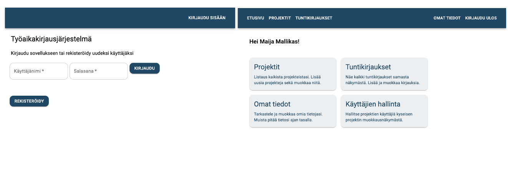
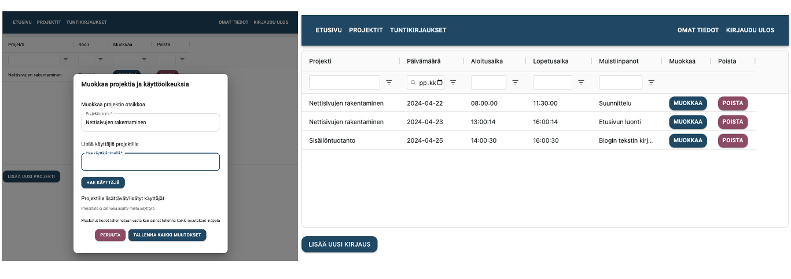

# Työaikakirjausjärjestelmä - Team Red

Projekti on toteutettu Haaga-Helian Ohjelmistoprojekti2 kurssilla.
Toteuttava tiimi: [Sonja Helminen](https://github.com/s0ina), [Katja Jääskeläinen](https://github.com/jinblo), [Kristin Luik](https://github.com/kristinLu), [Ulla Montonen](https://github.com/UllaMontonen) ja [Anton Rezin](https://github.com/antonrezin). 

## Sovelluksen tarkoitus

Sovelluksen tarkoitus on toimia työaikakirjausjärjestelmänä, esimerkiksi yksityisyrittäjille, joiden on pidettävä kirjaa tehdystä työstä ja sen kestosta. Käyttäjällä voi samanaikaisesti olla hallinnoitavana useita projekteja, joille voidaan kohdentaa omia työaikakirjauksia. Sovelluksessa käyttäjä voi kirjoittaa muistiinpanoja tehdystä työstä ja merkitä työn keston sekä päivämäärän. Lisäksi työtunnit voidaan laskea yhteen käyttäjän valitsemalta ajanjaksolta tai projektilta. Käyttäjä voi lisätä myös muita käyttäjiä omille projekteilleen ja valita missä roolissa he ovat projektissa. Käytössä olevat projektikohtaiset roolit ovat omistaja (owner), käyttäjä (user) sekä seuraaja (viewer). Projektin omistajalla on kaikki oikeudet projektiin, käyttäjä voi lisätä tuntikirjauksia projektille ja seuraaja näkee vain projektin tiedot ja siihen tehdyt tuntikirjaukset.

## Tärkeimmät ominaisuudet

Sovellus vaatii rekisteröitymisen. Rekisteröitynyt käyttäjä voi luoda projekteja ja tehdä projekteille työaikakirjauksia. Hän voi myös lisätä muita käyttäjiä projekteilleen.

## Käyttöliittymä

## Toteutusteknologiat
* Spring Boot 3.2.1
* Java jdk-17.0.2
* React 18.2.0
* JavaScript
* Node 20.11.0

## Riippuvuudet
* Spring Boot Starter Actuator
* Spring Boot Starter Web
* Spring Boot DevTools
* Spring Boot Starter Test
* Spring Boot Starter Data JPA
* Spring Boot Starter Security
* Spring Boot Starter validation
* Spring Boot Maven plugin
* H2 database
* MySQL Connector Java
* PostGRE SQL
* JSON Web Token (api, impl, jackson)

## Tietokanta

### Project / projekti

| Attribute           | Type                    | Description                     | Validation                | Requirements |
|:------------------- |:------------------------|:--------------------------------|:--------------------------|:-------------|
| id (PK)             | long /Integer           | Project id                      |                           |              |
| title               | String / Varchar        | Projektin nimi                  | A-z0-9.,-_!"#%&/()=?*{}[] | 51>length>1  |
| Set UserProjectRole | roles / OneToMany       | Projektin roolit                |                           |              |
| List Entry          | entries / OneToMany     | Projektiin liittyvät kirjaukset |                           |              |

### Entry / työaikakirjaus

| Attribute           | Type                    | Description                     | Validation                | Requirements |
|:------------------- |:------------------------|:--------------------------------|:--------------------------|:-------------|
| id (PK)             | long / Integer          | Entry id                        |                           |              |
| comment             | String / Varchar        | Kirjauksen kommentti            | A-z0-9.,-_!"#%&/()=?*{}[] | length<251   |
| entry_date          | LocalDate / Date        | Kirjauksen päivämäärä           | 0-9-                      | 'YYYY-MM-DD' |
| start_time          | LocalTime / Time        | Aloitusajankohta                | 0-9:                      | 'HH:mm:ss'   |
| end_time            | LocalTime / Time        | Lopetusajankohta                | 0-9:                      | 'HH:mm:ss'   |
| project_id (FK)     | JoinColumn / ManyToOne  | Viittaus projektiin             |                           |              |
| appUser_id (FK)     | JoinColumn / ManyToOne  | Viittaus käyttäjään             |                           |              |

### AppUser / käyttäjä

| Attribute           | Type                    | Description                      | Validation                | Requirements |
|:------------------- |:------------------------|:---------------------------------|:--------------------------|:-------------|
| id (PK)             | long / Integer          | AppUser id                       |                           |              |
| first_name          | String / Varchar        | Käyttäjän etunimi                | A-z-                      | 21>length>2  |
| last_name           | String / Varchar        | Käyttäjän sukunimi               | A-z-                      | 31>length>2  |
| username            | String / Varchar        | Käyttäjän käyttäjätunnus         | A-z._-@                   | 21>length>3  |
| password_hash       | String / Varchar        | Salasana hash muodossa           | A-z0-9.,-_!"#%&/()=?*{}[] | 101>length>7 |
| Set UserProjectRole | roles / OneToMany       | Projektin roolit                 |                           |              |
| List Entry          | entries / OneToMany     | Projektiin liittyvät kirjaukset  |                           |              |

## Api-dokumentaatio

* [Entry](api-docs/entry/)
* [Project](api-docs/project/)
* [AppUser](api-docs/appuser/)
* [Login](api-docs/login.md)
* [Register](api-docs/appuser/post.md)

## Projektin backlogit

Sprint backlogille on listattu kehitysideoita, jotka löytyvät myös projektin issues-kohdasta

* [Sprint backlog](https://github.com/orgs/TeamRed-Ohjelmistoprojekti2/projects/3/views/2)
* [Product backlog](https://github.com/orgs/TeamRed-Ohjelmistoprojekti2/projects/3)

## Loppuraportti

* [Loppuraportti](Loppuraportti.md)

## Tunnistautuminen
Käyttäjän tulee olla kirjautunut, jotta hän pääsee käyttämään palvelua. Tunnistautumisessa on käytössä JSON Web Token. Rekisteröityminen onnistuu luonnollisesti ilman tunnistautumista. Jokaisen pyynnön yhteydessä tarkistetaan token.

## Testaus
End-to-End testaus on toteutettu Robot Frameworkilla. Testit on jaettu niin, että omat testit voidaan toteuttaa lokaalisti sekä julkaistulla versiolla. Testit testaavat REST toiminnallisuuksia. Testien tekeminen vaatii Python ja pip asennukset. Uusin release testattu ja testit menneet läpi onnistuneesti.

End-to-end testien lisäksi toteutimme myös manuaalista testaamista tiimin voimin. 

## Tiedossa olevat virheet
* Yksi olemassa oleva virhe on se, että käyttäjä voi lisätä tuntikirjauksia myös projekteille, joissa hänellä on viewer rooli. Kun lisätään uutta työaikakirjausta, tulisi projektien kohdalla näyttää ainoastaan projektit, joissa käyttäjällä on rooleina joko owner tai user. Nyt listassa näkyy myös projektit, joissa käyttäjän rooli on viewer.
* GitHub Pages sivulla jos manuaalisesti päivittää sivun niin tietyillä välilehdillä ollessa saa error virheen näkyville. Kyseessä GitHub Pagesin single page applicationista johtuva virhe. Toimii lokaalissa moitteetta.

## Työaikakirjausjärjestelmän asennusohjeet
Asennusta varten tarvitset koneellesi tässä dokumentissa mainitut toteutusteknologiat sekä tekstieditorin, esim. Visual Studio Code tai Eclipse. Voit kloonata TimeManagement järjestelmän komennolla: `git clone https://github.com/TeamRed-Ohjelmistoprojekti2/TimeManagement.git`. Tässä tulee mukana sekä backend (TimeManagementBE) että frontend (TimeManagementFE).

### Backend
Backendin voit käynnistää esimerkiksi Visual Studio Codessa avaamalla TimeManagementBeApplication.java -tiedoston ja painamalla Coden navigaatiosta `Run` sekä `Start Debugging`. Tämä käynnistää Spring Bootin ja avaa Codeen uuden terminaalin missä näkyy sovelluksen käynnistyminen. Tämä käynnistää backendin lokaalisti osoitteeseen: http://localhost:8080/

### Frontend
Frontin asennusta varten navigoi TimeManagementFE kansioon ja anna siellä terminaalissa komento `npm install`. Tämä asentaa tarvittavat riippuvuudet. Saat frontin käyntiin komennolla `npm run dev`. Tämä käynnistää frontin locaalisti osoitteeseen http://localhost:5173/TimeManagement/

## Julkaisu
* Projektin backend on julkaistu [Herokussa](https://redtime-ffe09e78e9dd.herokuapp.com/)
* Projektin frontend on julkaistu [GitHub Pagesissa](https://teamred-ohjelmistoprojekti2.github.io/TimeManagement/)

### Tietokannan vaihtaminen
Projektista löytyy tiedot sekä lokaaliin kehitykseen, että projektin julkaisuun liittyen. Käytössä on application.properties tiedostot, joiden avulla voidaan vaihtaa käytössä olevaa tietokantaa. application-dev.properties toimii lokaalissa ja application-heroku.properties julkaistussa versiossa. Käytössä olevan profiilin määritys tapahtuu application.properties tiedostossa. Frontti ja bäkki vaativat myös muutoksia riippuen käytetäänkö molempia lokaalissa vai vaan toista. Muutosta mahdollisesti vaativat tiedostot: CorsFilter.java, WebSecurityConfig.java, pom.xml, TimeManagementBeApplication.java sekä baseUrl.jsx
